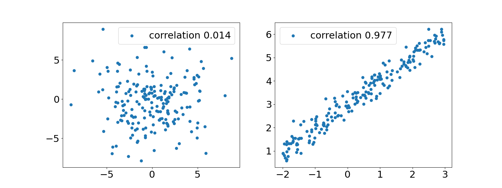
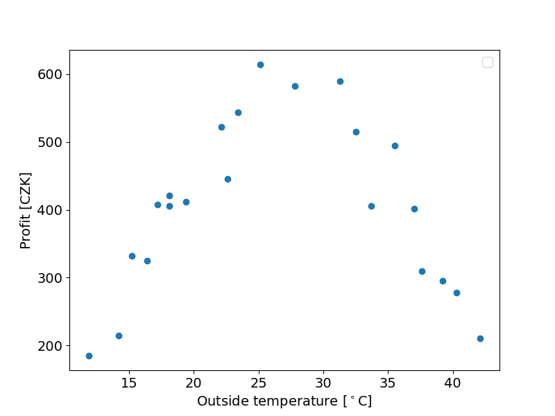

# Correlation

Often when dealing with variables that are measured simultaneously or co-localy (or with some other direct relation) we could be interested in the relation of those variables. In other words we are interested in the dependece of two variables. A measure of dependence is correlation. It is **not equivalent** to dependance as we will see in a moment. Formally, the coefficient of correlation is defined as follows:

$$
\rho_{X,Y} = \frac{\text{cov}(X,Y)}{\sigma_x \sigma_y} = \frac{\text{E}\big((X - \text{E}X)(Y - \text{E}Y)\big)}{\sqrt{\text{E}(X - \text{E}X)^2\text{E}(Y - \text{E}Y)^2}},
$$

where E(X) is the mean value of X and cov, as explicitly written out at the end, is the covariance of two variables. By rescaling the covariance by the standard deviations of both of the variables we obtain a number in the interval (-1,1) which is a measure of linear dependance of two variables as is visualised in the following image.



## Pearson coefficient

The apropriate estimator of the coefficient of correlation is the so called Pearson correlation coefficient, where we replace all mean values by sample means and standard deviations by sample standard deviations:

$$
\text{E}(X) \rightarrow \bar{x} = \frac{1}{N}\sum\limits_{i=1}^N x_i \hspace{1cm} \text{and} \hspace{1cm} \sigma_x \rightarrow \sqrt{\frac{1}{N - 1}\sum\limits_{i=1}^N (x_i - \bar{x})^2}.
$$

Let's now try it in code. First we load and display data to work with:

```python
--8<-- "Correlation/correlation.py:2:3"
--8<-- "Correlation/correlation.py:5:12"
--8<-- "Correlation/correlation.py:19:35"
--8<-- "Correlation/correlation.py:77:80"
```

???+ Success "Output"
    

Now we define a function which calculates the pearson correlation coefficient

```python
--8<-- "Correlation/correlation.py:38:57"
```

and call it in main

```python
--8<-- "Correlation/correlation.py:14:15"
```

???+ Success "Output"
    ```
    0.034787378587840805
    ```

This result shows us that the data is very much uncorrelated. This however does not mean that it is independent. We can very well se a structure in the previous plot - profits rise with temperature (people are more likely to buy ice cream when it's warm) up to a point, then profits start falling again (it's too hot to even go outside).

Notice the function was written in as natural way as possible. That is, there are many ways to optimize our program. One option is to use **numpy** :

```python
import numpy as np

--8<-- "Correlation/correlation.py:60:61"
```

Here many of the operations like addition, multiplication and exponentiation are performed on entire arrays of data instead of individual elements. The outcome however is the same up to some round up error.

???+ Success "Output"
    ```
    0.03478737858784084
    ```

To notice the difference in speed we use a larger dataset. We can reuse the weather data from the initial python tutorial - there are about 350000 entries there.

```python
df = pd.read_csv('path/to/weather_data.csv')
time = np.arange(0, 1000000)
```

Runtime can be measured with the **time** library:
```python
import time

start = time.time()
#some code
end = time.time()
print(end - start)
```

If we measure the runtimes for *pearson_for_cycles()* and *pearson_numpy()* we find the latter to be about 50 times faster (results may vary depending on your machine and setup). The absolute difference is about 300 ms which is insignificant if run the code once. If a piece of code, however, is supposed to run many times or is expected to crunch a much larger dataset, optimization becomes extremely important.

!!!tip "Task"
    Define a new function that will utilize the fact that our data is already a pandas dataframe and will only use methods defined for the dataframe instead of functions from numpy. Check if there is any difference in runtime.

## Spearman coefficient

There is a second approach to correlation - the Spearman correlation. In this case we are not necessarily interested in linear dependance of two variables but rather their monotonical dependence. I.e. when two variables rise monotonically together (or one rises while the other falls) they will have high Spearman correlation. To quantify things we need to rank our data - sort it according to value. Let's come back to the ice cream profits.

|temperature|-|profit|-----|-----|
|---|---|---|---|---|
|Value|rank|Value|rank|difference
|14.2	|2	    |215	|3|1
|16.4	|4	    |325	|7|3
|11.9	|1	    |185	|1|0
|15.2	|3	    |332	|8|5
|18.1	|6	    |406	|10|4
|22.1	|9	    |522	|18|9
|19.4	|8	    |412	|13|5
|25.1	|12     |614	|22|10
|23.4	|11     |544	|19|8
|18.1	|6	    |421	|14|8
|22.6	|10     |445	|15|5
|17.2	|5	    |408	|12|7
|37.6	|19     |310	|6|13
|33.7	|16     |406	|10|6
|42.1	|22     |211	|2|20
|27.8	|13     |582	|20|7
|32.5	|15     |515	|17|2
|39.2	|20     |295	|5|15
|31.3	|14     |589	|21|7
|35.5	|17     |494	|16|1
|37.0	|18     |402	|9|9
|40.3	|21     |278	|4|17

The Spearman correlation coefficient is defined as

$$
\rho_s = 1 - \frac{6 \sum_i^N d_i^2}{N (N^2 - 1)}, \hspace{1cm} d_i ~ \text{is the rank difference}.
$$

Writing a function that will return a ranked list might get a bit messy with just some for-loops. Fortunately pandas dataframe already has a method implemented. We make a new function for the Spearman coefficient:

```python
--8<-- "Correlation/correlation.py:64:71"
```

running the function yields a value of about 0.005, or essentially no monotonic correlation. This of course could have been guessed just by looking at the plot of our data - it clearly does not follow a monotonic dependence.

!!!tip "Task"
    Define some non-linear monotonic function and compare the values of the Spearman and Pearson correlation coefficients.