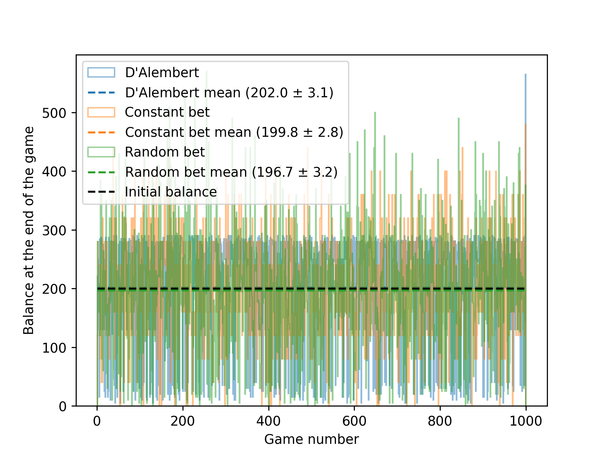

# D'Alembert Strategy

The d'Alembert strategy is a betting system often used in gambling. It is named after the French mathematician Jean le Rond d'Alembert. The strategy is based on the idea of balancing wins and losses, and it is considered a more conservative approach compared to other betting systems like the Martingale.

### How the d'Alembert Strategy Works

1. **Initial Bet**: You start with a base bet, which is the amount you choose to wager initially.
    
2. **Increasing Bets**: If you lose a bet, you increase your next bet by one unit. For example, if your base bet is $10 and you lose, your next bet would be $20.
    
3. **Decreasing Bets**: If you win a bet, you decrease your next bet by one unit. So, if you win after betting $20, your next bet would return to $10.
    
4. **Goal**: The goal of the d'Alembert strategy is to achieve a balance between wins and losses over time, with the idea that the number of wins and losses will eventually even out.

<figure markdown="span">
  [](DAlembert.webp)
  <figcaption>AI's illustration :)</figcaption>
</figure>

## Theory

We suppose there are two possible outcomes of the game, red and black, with the same probability
$$
P(R) = 1/2 = P(B).
$$

Intuition would suggest

$$
P(R |\text{previous was black}) > P(R) > P(R |\text{previous was red}),
$$

because the number of red and black outcomes should balance over time. This is the core of the D'Alembert strategy.

However, this is wrong, as can be illustrated by the [simulations](#code). Each round is independent of the previous one, therefore by definition of the [conditional probability](https://en.wikipedia.org/wiki/Conditional_probability)

$$
P(R |\text{previous was black}) = P(R) = P(R |\text{previous was red}).
$$

## Code

=== "Python"

    The code bellow compares the D'Alembert strategy with two other strategies:

    - **Always bet the same**: the bet is the same in every run, regardless the output of the previous round.
    - **Random bet**: the decision of whether the bet should be increased or decreased before each round is randomized.

    The strategies are compared by multiple simulated games with a fixed number of runs. 

    !!! note
        The implementation of the D'Alembert strategy is higlighted in the code bellow.

    ```python hl_lines="58-76"
    --8<-- "dalembert/DAlembert.py"
    ```

    ???+ success "Output"
        The output is a plot illustrating the comparison of the three strategies and the average end of the game balance.
        [](DAlembert.png)

        Notice that all three results are the same within their errors, meaning that the D'Alembert strategy in this form does not lead to significantly better results. **This is because of the independance of the outputs of each of the rounds, as discussed at the end of the [theory section](#theory).**

    !!! tip "Advanced"
        Try to rewrite the code so that the `for` loop is avoided and the problem is solved via the vectorized approach.

=== "C++ and ROOT"
    
    The code bellow is the simulation of the D'Alembert strategy.

    ```C
    --8<-- "dalembert/DAlembert.C"
    ```

    ???+ success "Output"
        The output of the programe is a plot of the balance at the end of the game for multiple runs. It also prints in the terminal the total loss / win.

    !!! tip "Advanced"
        Try to implement other strategies (random bet, constant bet,...) for comparison.