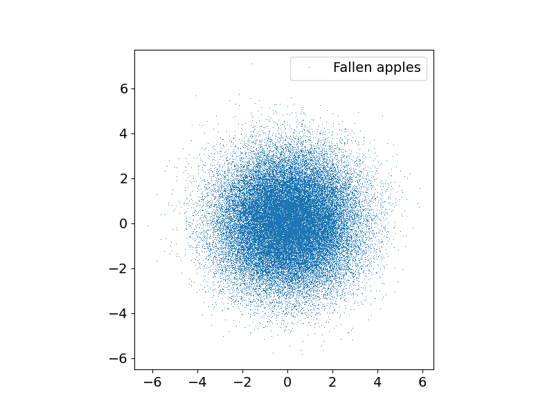
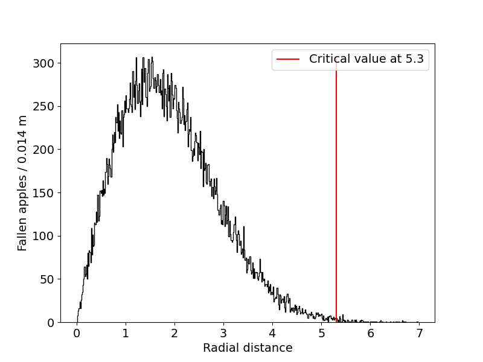
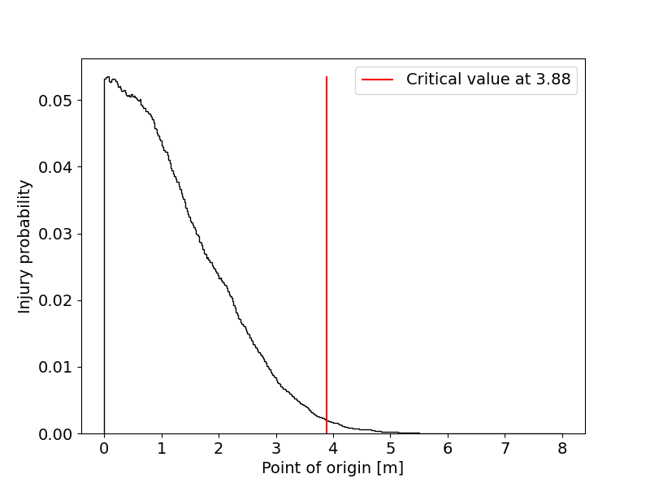

# Simulating random events

Picture sir Isaac Newton sitting in the shade of an apple tree. Suppose the tree is droping its fruit with a Gaussian distribution in the radial component with mean value 0 and standard deviation 1.5 m. How far should Newton sit to be safe from a head injury and presumably discovering the laws of gravity? 

<figure markdown="span">
  [](newton_ai.webp)
  <figcaption>AI's illustration :)</figcaption>
</figure>

This is of course a somewhat ridiculous problem but it should demonstrate some usecases for random numbers so let's tackle it. Now what exactly does it mean to be safe? Since we are dealing with Gaussian distribution, no distance is perfectly safe, so let's say that to be safe means that if you sit somewhere there is less than 0.2 % chance that an apple hits you.

A way to interpret this problem is to say that we are looking for the radial distance beyond which the probability of an apple falling is less than 0.2 %. First we calculate the safe distance theoretically.

## Theory

We suppose the distribution:

$$
f(x,y) = A \exp\bigg(-\frac{x^2}{2\sigma_x^2} -\frac{y^2}{2\sigma_y^2} \bigg) = A \exp\bigg(-\frac{r^2}{2\sigma^2} \bigg), \hspace{1cm} A = \frac{1}{\sqrt{2\pi\sigma}}
$$

We want to integrate over $r$ from 0 to $R$ such that the integral is equal to the residual probability $1 - p = 0.998$. We now work in polar coordinates:

$$
\int_0^R r dr \int_0^{2\pi} d\phi f(r) = ... = \int_{-R^2/2\sigma^2}^0 e^z dz = 1 - \exp(-R^2/2\sigma^2) = 1 - p.
$$

Rearanging the terms and inserting our presumed numbers ($\sigma = 1.5, p = 0.002$) we arrive at $R = 5.29$.

## Code

Now let's find this distance using random numbers. We generate a large random sample and check the distribution of points. In code it looks as follows.

```python
--8<-- "Newton/newton.py::2"
--8<-- "Newton/newton.py:4:8"
--8<-- "Newton/newton.py:50:71"
```

Here we have generated 50,000 points with the aforementioned Gaussian distribution and produced an image:

???+ Success "Output"
    

Now we calculate the radial distances of all of the points and make a histogram.

```python
--8<-- "Newton/newton.py:10:14"
```
```python
--8<-- "Newton/newton.py:19:38"
```

In the function *find_safe_distance()* we integrate the histogram from the left until the sum arrives at 99.8 % of our sample. That is where we say Newton is safe to sit.
???+ Success "Output"
    

This is the answer to our problem and checking the final number we see that we arrived quite close to the value predicted in the theory section. Just by looking at the histogram, however, something seems odd about our solution. It would seem that sitting right under the center of the tree is just as safe as sitting very far away. This is an artifact of our interpretation. The way we articulated the problem translates itself to Newton occupying a narrow band around the circle with constant width and varying radius. The area of the strip gets very small near the center and so the probability of an apple hitting this area is also small.

Let's now try a more realistic and hence more computationally demanding model. We suppose the same tree, only now Newton occupies a disk with 0.5 m radius and varying origin. Our problem is still radially symmetric so keeping say the x position of the origin at 0 should not change the solution of our problem. How do we calculate the probablity of an apple hitting a person? In principle easily. We still generate a random set, only now we ask how many points lie inside a circle instead of a band around the tree. Looking at the last image we see that given our sample size the furthest an apple is expected to fall is 7 m from the center. Let's say that at 8 m no apples are expected anymore. We will vary the y coordinate of the origin by 0.02 m on every iteration. Calculating the radial distance of a point from the circles origin is simple with numpy. We have actually done it already in the previous part when we calculated the points' radial distances from the tree center. The only thing that changes now is the point of origin.

```python
relative_position = apples[0] ** 2 + (apples[1] - y) ** 2
```

We want to perform many of these calculations so let's wrap it in a function.

```python
--8<-- "Newton/newton.py:41:49"
```
Inside our function we also used the function *np.where()* which asks which elements of an array meet some condition. We are only interested in the size of such subset so we ask for the length of the resulting array. Finally we divide this number by the total sample size to get an estimate our probability. We can again plot the result.

???+ Success "Output"
    

The result differs from the previous one quite a bit. Whereas before Newton would have to sit about 5.3 m away from the tree, now he can be comfortable more than a meter closer. If he chooses to sit with his back resting agains the tree, i.e. at a distance equal to his radius - 0.5 m - he risks an injury with about 5 % probability.
