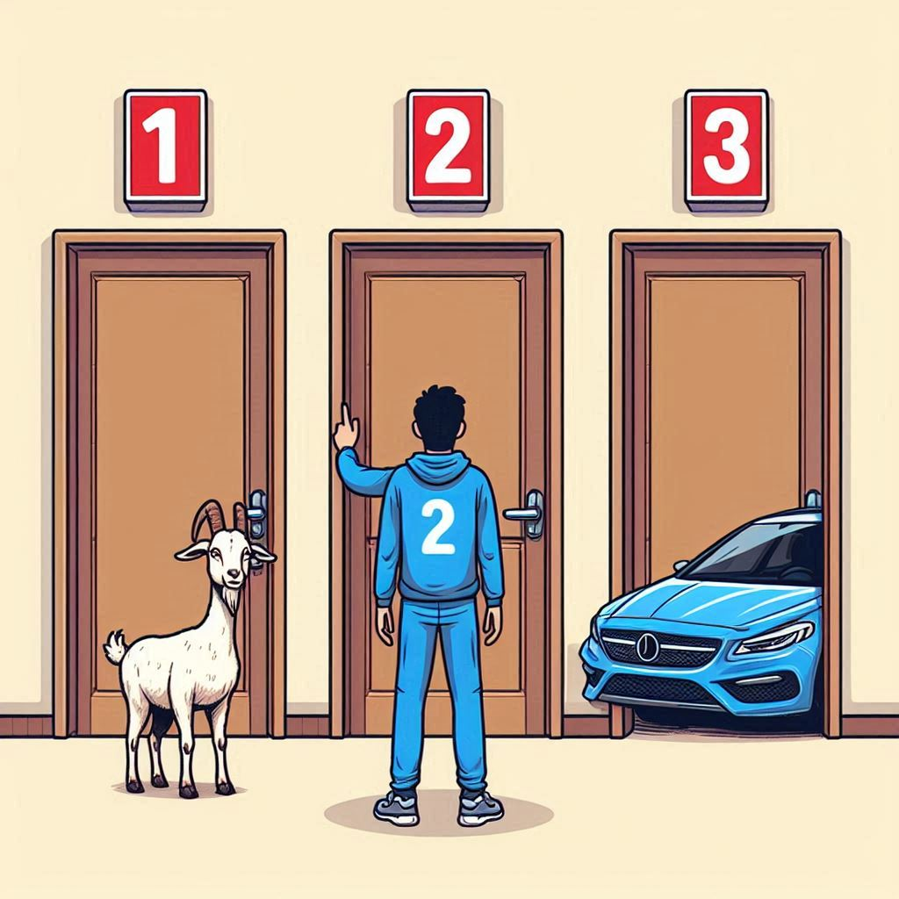

# The three door problem

The "three door problem," commonly known as the Monty Hall problem, is a probability puzzle based on a game show scenario. Here's how it works:

1. **Setup**: There are three doors: behind one door is a car (the prize you want), and behind the other two doors are goats (which you do not want).
2. **Initial Choice**: You, the contestant, choose one of the three doors. Let's say you choose Door 1.
3. **Host Action**: The host, who knows what is behind each door, then opens one of the other two doors, revealing a goat. For example, if you chose Door 1, the host might open Door 3, showing a goat.
4. **Final Decision**: You are then given the option to either stick with your original choice (Door 1) or switch to the remaining unopened door (Door 2).

**Question**: What should you do to maximize your chances of winning the car?

<figure markdown="span">
  [](monty-hall2.jpeg)
  <figcaption>AI's depiction of the problem :)</figcaption>
</figure>

## Theory

Let us number the doors 1,2 and 3. Without loss of generality, let us select door number 1. The probability that the prize is behind this door is simply

$$
P(\text{prize behind  }1) = 1/3.
$$

Now the host has to open either door number 2 or number 3. Since they are indistinguishable to us at this moment, let us suppose the host opens door number 3, indicating the prize is not behind them. Then the probability of the prize being behind door number 2 is, by definition,
$$
P(\text{prize behind  }2 | 3 \text{ is opened}) = \frac{P(3\text{ is opened} | \text{prize behind  }2) \cdot P(\text{prize behind  }2)}{P(3\text{ is opened})}.
$$

Now we have to evaluate each of the probabilities on the right-hand side:

1. The probability $P(3\text{ is opened} | \text{prize behind  }2)$ (door number 3 is opened provided that the prize is behind the door number two) is fairly simple to evaluate. If the prize is behind the door number 2 and we have previously selected the door number 1, the host cannot open either of them. Therefore, the host must open the door number 3, and so $P(3\text{ is opened} | \text{prize behind  }2) = 1$.
2. $P(\text{prize behind  }2)=1/3$ because the probability of the prize being behind each of the three doors is equal.
3. To evaluate the denominator, we use the [law of total probability](https://en.wikipedia.org/wiki/Law_of_total_probability)
    $$
    P(3\text{ is opened}) = P(3\text{ is opened} | \text{prize behind  }1)\cdot P(\text{prize behind  }1) 
    $$

    $$
    +  P(3\text{ is opened} | \text{prize behind  }2)\cdot P(\text{prize behind  }2) 
    $$

    $$
    +  P(3\text{ is opened} | \text{prize behind  }3)\cdot P(\text{prize behind  }3)
    $$

    - We have established that $P(\text{prize behind  }i) =1/2\quad \forall i  \in \{1,2,3\}$.
    - $\cdot P(\text{prize behind  }1) = 1/2$ because the host can open door number 2 or 3 (the prize is not behind either of them and we did not pick them) with the same probablity.
    - $P(3\text{ is opened} | \text{prize behind  }2) = 1$ as we have already discussed.
    - $P(3\text{ is opened} | \text{prize behind  }3) = 0$ because the host can not open the door if the prize is behind them.

    And therefore 

    $$
    P(3\text{ is opened}) = 1/2 \cdot 1/3 + 1 \cdot 1/3 + 0 = 1/2.
    $$

With these calculations, we can finally evaluate

$$
P(\text{prize behind  }2 | 3 \text{ is opened}) = \frac{1\cdot 1/3}{1/2} = 2/3.
$$

This means that we should always change our selection after the host opens the door, as it will double our probability of success.

## Programming

!!! example "Task"

    Write a short script that would simulate the three door problem for n times and based on the result verified our probability results. Use the prepared script bellow or write your own one.


=== "Python"

    Finish the missing parts marked with `#TODO`.

    ```python 
    --8<-- "problem tri dveri/dvere_empty.py"
    ```

    ???+ success "Output"
        The output of the problam are the correction rates of the choices and a plot showing its dependance on the number of iterations.

        [](dvere.png)

    !!! tip "Advanced"
        Try to rewrite the code so that the `for` loop is avoided and the problem is solved via the vectorized approach.
