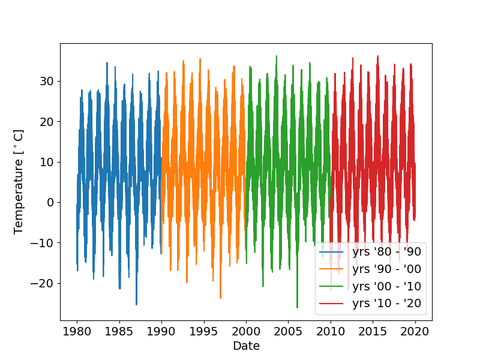

# Data Analysis and Visualization in Python
Python is a powerful tool nowadays used as industry standard for data science. It is also relatively easy to use. This tutorial is by no means an exhaustive set of usecases, its purpose is merely to demonstrate some of the many useful features of python and its libraries. In the following paragraphs we will learn how to load, process and visualise our data with some standard libraries like:

1. **Numpy** - Array (vectors, matrices, etc.) manipulation - addition, multiplication and other operations between arrays, applying functions to arrays and much more,

2. **Matplotlib** - plotting and saving images of many kinds,

3. **Scipy** - fitting, extremization of functions, statistics, etc.,

4. **Pandas** - data input and output.

Sometimes when many files spread across several directories are used, **Pathlib** can be very useful for their management. The general structure of a python file will look the following way:


## Loading data from files 
Depending on the complexity of our dataset, several approaches can be used. Rarely ever is the standard python *open()* function an optimal choice. When a simple csv file with only number inputs is to be loaded, *numpy.genfromtxt()* is a good option. It converts space separated data into a numpy array which can then be further manipulated. For larger datasets or more complex datatypes pandas offers several read-type functions (among which *read_csv()* is an option as well). Let's now try loading a simple shopping list.

```python
--8<-- "python_tutorial/groceries.py"
```
As you can see all dependencies are imported at the beginning of the document, then function definitions are implemented and last comes the main body of the code (in this case the executing if statement). The output of the above code is the following:

???+ success "Output"
    ```
    ['chleb', 'mleko', 'vejce', 'maslo', 'jablka', 'banany', 'rajcata', 'paprika', 'kureci', 'testoviny'] 1310
    ```

## Plotting data
Now let's try a larger dataset. For our toy data we can use e.g. the average temperature in the Czech Republic in the last ~45 years. Loading is the same as before

```python
filename = 'weather_data.csv'
df = pd.read_csv(filename)
```

We can either check the csv file directly to see what are the column headers or we can call it in our program:

```python
print(df.columns) #display column names. 
```
???+ success "Output"
    ```
    Index(['utc_timestamp', 'CZ_temperature'], dtype='object')
    ```
In pandas columns are called by their names, while the elements of a column are still indexed with numbers:

```python
print(df["CZ_temperature"][:10].tolist()) # the string calls the column, the [:10] calls the first 10 elements of that column. Any range (if it exists) n -> m can be called with [n:m]
```
The *tolist()* function converts the pandas dataframe into a python list.

???+ success "Output"
    ```
    [-3.422, -3.36, -3.429, -3.697, -4.081, -4.177, -4.192, -3.951, -2.905, -1.887]
    ```

In complete analogy we can print out the elements of the *utc_timestamp* column. Elements of this column are in the format *YYYY-MM-DDThh-mm-ss*.

To plot our data we need to import a plotting library at the start of our script:

```python
import matplotlib.pyplot as plt
```

because pyplot does not know the time format, we need to convert it to datetime first, then we plot and display the figure on screen:

```python
time = pd.to_datetime(df['utc_timestamp'])
plt.plot(time, df['CZ_temperature'])
plt.show()
```

The resulting image should look like this:

???+ success "Output"
    

This image is quite raw, we should name the axes, change font size etc. All of this can be wrapped inside a function that can be recycled in the future:

```python
--8<-- "python_tutorial/temperature.py"
```

Several neat features of pandas dataframes were used. An extended tutorial can be found in the [official documentation](https://pandas.pydata.org/docs/reference/frame.html). Running our script will result in this image

???+ success "Output"
    

For more options on color, linestyles and much more check the official [matplotlib documentation](https://matplotlib.org/stable/tutorials/pyplot.html).