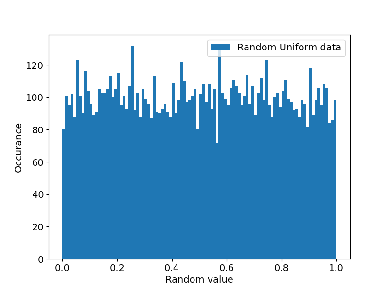

# Data Analysis and Visualization in Python
Python is a powerful tool nowadays used as industry standard for data science. It is also relatively easy to use. This tutorial is by no means an exhaustive set of usecases, its purpose is merely to demonstrate some of the many useful features of python and its libraries. In the following paragraphs we will learn how to load, process and visualise our data with some standard libraries like:

1. **Numpy** - Array (vectors, matrices, etc.) manipulation - addition, multiplication and other operations between arrays, applying functions to arrays and much more,

2. **Matplotlib** - plotting and saving images of many kinds,

3. **Scipy** - fitting, extremization of functions, statistics, etc.,

4. **Pandas** - data input and output.

Sometimes when many files spread across several directories are used, **Pathlib** can be very useful for their management. The general structure of a python file will look the following way:


## Loading data from files 
Depending on the complexity of our dataset, several approaches can be used. Rarely ever is the standard python *open()* function an optimal choice. When a simple csv file with only number inputs is to be loaded, *numpy.genfromtxt()* is a good option. It converts space separated data into a numpy array which can then be further manipulated. For larger datasets or more complex datatypes pandas offers several read-type functions (among which *read_csv()* is an option as well). Let's now try loading a simple shopping list.

```python
--8<-- "python_tutorial/groceries.py"
```
As you can see all dependencies are imported at the beginning of the document, then function definitions are implemented and last comes the main body of the code (in this case the executing if statement). The output of the above code is the following:

???+ success "Output"
    ```
    ['chleb', 'mleko', 'vejce', 'maslo', 'jablka', 'banany', 'rajcata', 'paprika', 'kureci', 'testoviny'] 1310
    ```

## Plotting data
Now let's try a larger dataset. For our toy data we can use e.g. the average temperature in the Czech Republic in the last ~45 years. Loading is the same as before

```python
filename = 'weather_data.csv'
df = pd.read_csv(filename)
```

We can either check the csv file directly to see what are the column headers or we can call it in our program:

```python
print(df.columns) #display column names. 
```
???+ success "Output"
    ```
    Index(['utc_timestamp', 'CZ_temperature'], dtype='object')
    ```
In pandas columns are called by their names, while the elements of a column are still indexed with numbers:

```python
print(df["CZ_temperature"][:10].tolist()) # the string calls the column, the [:10] calls the first 10 elements of that column. Any range (if it exists) n -> m can be called with [n:m]
```
The *tolist()* function converts the pandas dataframe into a python list.

???+ success "Output"
    ```
    [-3.422, -3.36, -3.429, -3.697, -4.081, -4.177, -4.192, -3.951, -2.905, -1.887]
    ```

In complete analogy we can print out the elements of the *utc_timestamp* column. Elements of this column are in the format *YYYY-MM-DDThh-mm-ss*.

To plot our data we need to import a plotting library at the start of our script:

```python
import matplotlib.pyplot as plt
```

because pyplot does not know the time format, we need to convert it to datetime first, then we plot and display the figure on screen:

```python
time = pd.to_datetime(df['utc_timestamp'])
plt.plot(time, df['CZ_temperature'])
plt.show()
```

The resulting image should look like this:

???+ success "Output"
    

This image is quite raw, we should name the axes, change font size etc. All of this can be wrapped inside a function that can be recycled in the future:

```python
import pandas as pd
import matplotlib.pyplot as plt


def main():
    filename = 'weather_data.csv'
    df = pd.read_csv(filename)
    time = pd.to_datetime(df['utc_timestamp'])

    ref_times = ["1980-01-01","1990-01-01","2000-01-01","2010-01-01", "2020-01-01"] #create reference datetimes to showcase conditional operation on pandas dataframes

    xdata = [time[(time >= n) & (time < m)] for n, m in zip(ref_times[:-1], ref_times[1:])] # pandas allows conditional operation on its elements, in this case our time axis is split into 4 regions according to a decade time intervals
    ydata = [df['CZ_temperature'][(time >= n) & (time < m) ] for n, m in zip(ref_times[:-1], ref_times[1:])] # the temperature column is split with the same conditional mask
    labels = ['yrs \'80 - \'90','yrs \'90 - \'00','yrs \'00 - \'10','yrs \'10 - \'20'] # label strings for the plot legend

    simple_plot(xdata, ydata, labels, 'Date' ,'Temperature [$^\\circ$C]', 'temperature.png') #calling the plot function inside the main function


def simple_plot(xdata, ydata, labels, xlabel, ylabel, filename = None): #function for plotting several datasets into the same image, x and ydata are expected to be lists of arrays. If only a single dataset is to be plotted, it must also be inside a list -> dataset = [dataset]

    plt.rcParams['font.size'] = 14 # changes font size
    fig, ax = plt.subplots(figsize = [8,6]) # creates a figure and a subplot object

    for x, y, l in zip(xdata, ydata, labels): # loop over several arrays at once (cuts when the first array finishes)
        ax.plot(x, y, label = l) # line plot of x and y with a label to displayed inside a legend

    ax.legend() # includes a legend in the image
    ax.set_xlabel(xlabel) # gives a name to the x axis, below analogy for y axis
    ax.set_ylabel(ylabel) # matplotlib supports latex like math type-setting

    plt.show() # displays the current figure 
    if filename:
        fig.savefig(filename) # saves the figure 'fig' as a png file


if __name__ == "__main__":
    main()
```

Several neat features of pandas dataframes were used and described in the code. An extended tutorial can be found in the [official documentation](https://pandas.pydata.org/docs/reference/frame.html). Running our script will result in this image

???+ success "Output"
    

For more options on color, linestyles and much more check the official [matplotlib documentation](https://matplotlib.org/stable/tutorials/pyplot.html).

## Data Analysis

Staying with our toy weather data and code we can show how simply it can be analysed with python. We of course notice that temperature in the Czech Republic changes periodically with the seasons. Let's find out what the period according to temperature is. For that we can run Fourier transform in a newly defined function and some libraries.

```python
import numpy as np
from scipy import fft, fftfreq
```

```python
def fourier(time, data):
    yf = fft(data) # creates a complex array of fourier transformation, amplitude is in encoded in magnitude, phase is encoded in the angle of the complex number
    xf = fftfreq(time.size) # creates sampling frequency array for further analysis and plotting

    periods = 1 / xf / 24 # inverts the frequencies into periods
    simple_plot([periods], [np.abs(yf)], ['fourier transform'], 'fft_temperature.png', 'Period [days]', 'Amplitude [arb.]')
     
```
We can then call this function inside the main function. The code produces the following image.

???+ Success "Output"
    

There are two main frequencies - 365 days and 1 day - exactly as would be expected. Negative frequencies are important when dealing with complex data. Given that our data is strictly real we can ignore the negative part. 

Knowing the period we might try fitting the data with a sin function. For this we can use the function *curve_fit* from the **scipy.optimize** library. All we need to use it is to define our function for fitting which will depend on a single variable and several parameters to be determined. In this case we include:

```python
from scipy.optimize import curve_fit
```
and define

```python
def sinx(x, amp, freq, phase, con):
    return amp * np.sin(2 * np.pi * freq * x + phase) + con
```

To determine the parameters *amp, freq, phase* and *con* we use:

```python
fit, pcov = curve_fit(sinx, xdata, ydata, p0 = [amp0, freq0, phase0, con0])
```
where he *p0* parameter is our initial guess. Because the temperature data is so noisy - we know that at least 2 frequencies are strongly present while we are only trying to fit one - the fit might be difficult to converge. When the algorithm converges it will produce a parameter fit array which we called *fit* and a covariance matrix called *pcov* the meaning of which will be discussed later in the lecture. To plot the fitting function we define a new array:

```python
fit_values = sinx(xdata, *fit)
```
where the * operator call the individual elements of our array as separate parameter inputs. 

!!!tip "Task"
    Complete the code such that it produces the following image. Use our predefined plotting function.

???+ Success "Output"
    

This fit of course does not tell us much since the period was pretty much known from the Fourier transform and the amplitude varies significantly. Nevertheless fitting is a very powerful tool and it is important to know the method for future refference.

## Histograms

Let's now leave the weather data behind and generate some of our own. Random number generation is also very important in statistics as we shall see in the near future. Much like many other things in python, generating a *pseudo*random set of numbers is as easy as inluding a single line. We will now be working mostly with [**numpy**](https://numpy.org/doc/stable/user/basics.html)

```python
import numpy as np
```

Numpy includes many of the most used distributions like uniform, gaussian, etc. These can be generated as n-dimensional arrays. Let's start with a single dimension:

```python
random_data1D = np.random.uniform(0, 1, 10000) # first and second value determine the limits of our interval, the final number is dataset size
```

A uniformly distributed set of values is expected populate intervals of the same size roughly equally. Let's check this fact visually in a histogram:

```python
values, edges = np.histogram(random_data1D, bins = 100)
```
The *bins* parameter can either take an integer value for the number of bins that will be created - minimum and maximum is determined from the dataset - or it can take an array of real values indicating the edges of our bins. We shall use this fact in a moment for a sum of histograms. For plotting a histogram we make use of the **matplotlib.pyplot** function *stairs*:

```python
plt.stairs(values, edges, label)
```

which will produce an image similar to the following after stylizing it:

???+ Success "Output"
    


!!!tip "Task"
    Wrap the *stairs* function in a similar fashion as our *simple_plot* function for future reference.

How to check if a set of data is distributed according to some distribution will be done in a later part of the lecture. Now let's move over to higher dimensional histograms. We can start by generating 2 sets of random gaussian 2D data:

```python
gaus1 = np.random.normal(6, 0.5, [2, 5000]) # generates 2 random sets of gaussian distributed values with mean value 4 and sigma 0.5 with size 5000
gaus2 = np.random.normal(5, 0.3, [2, 1000])
```

To transform these sets to 2d histograms we use the numpy function *histogram2d*:
```python
hist1, xedges, yedges = np.histogram2d(*gaus1, bins = [20,20]) # generates a 2d histogram with 20 bins on each axis. The * operator has to be used to call both axes of our gaussian array
hist2, xedges, yedges = np.histogram2d(*gaus2, bins = [xedges, yedges]) # this time instead of automatically producing the bin edges we use those edges created previously
```
Now the variables *hist1* and *hist2* contains the number of values in each bin whose edges are defined in the variables *x/yedges*. Since both histograms have the same bin edges we can add the values of *hist1* and *hist2* together:

```python
hist = hist1 + hist2
```

For plotting we again define a custom function:

```python
def plot_histogram2d(hist, xedges, yedges, xlabel, ylabel, filename = None):
    plt.rcParams['font.size'] = 14
    fig, ax = plt.subplots(figsize = [8,6])
    hist_fig = ax.imshow(hist, extent = [xedges[0], xedges[-1], yedges[0], yedges[-1]])
    fig.colorbar(hist_fig)
    ax.set_xlabel(xlabel)
    ax.set_ylabel(ylabel)
    plt.show()
    if filename:
        fig.savefig(filename)
```

and we call it in the main function

```python
plot_histogram2d(hist, xedges, yedges, 'x label', 'y label', '2d_histogram.png')
```

A result may look like this:
???+ Success "Output"
    


## Conclusion
It was hopefully demonstrated that data analysis and visualisation is quite simple yet effective with use of the right python libraries. Of course all of those showcased here are much more extensive than can be covered in such a short tutorial. Whenever you get to analyse your data I sincerely recommend checking the documentation of these libraries (or just google) if a solution to your problem has not already been implemented.