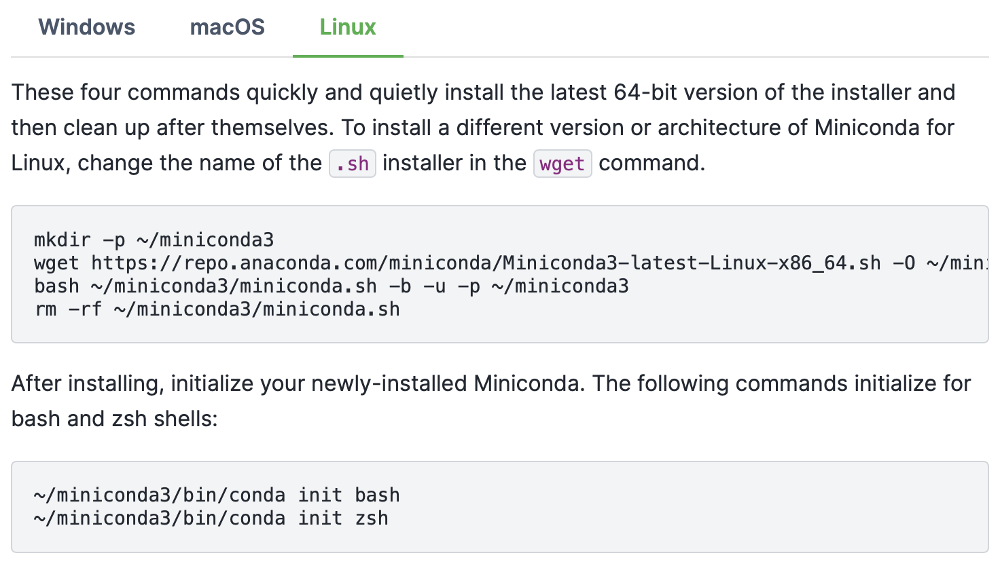
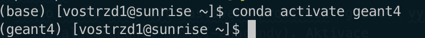

# Geant4 instalace pomocí [Anaconda](https://www.anaconda.com/){:target="_blank"} 

<!-- ## Setup bez vlastní lokální instalace

### C++

Správné prostředí se nastaví pomocí 

```shell
. /data2/vyuka/szd/SZD2-codes/setup_ROOTandPython3.sh
```

Projekt `test_geant.cpp` pak lze kompilovat příkazem

```shell
gcc test_geant.cpp `geant4-config —libs —cflags` -lstdc++
```

### Python

Prostředí se nastaví pomocí 

```shell
. /home/vostrzd1/SZD2/setup_GeantPython.sh
```


???+ info
    Tohle pak můžeme předělat na tvoje, až si to nainstaluješ.

Správnost nastavení si lze ověřit zapnutím pythonu (příkaz `python`) a následně uvnitř Pythonu příkazem 

```python 
import geant4_pybind
```

Pokud se nevypíše žádný error, setup proběhl úspěšně. 


 -->

## Instalace pro Python

Pro instalaci použijeme [Anacondu](https://anaconda.org), což je package a environment manager pro Python. Jedná se o jednu z [oficiálně doporučených instalací Geant4](https://geant4-userdoc.web.cern.ch/UsersGuides/InstallationGuide/html/index.html#conda-on-linux-macos). Pří lokální instalaci tímto způsobem půjde kompilovat i C++ verze Geantu.

Příprava Geant4 pro Python je popsána v následujících krocích.

!!! note
    Pro instalaci je dobré mít otevřený nový terminál, ve kterém nejsou setupovaná žádná prostředí.

### 1. Instalace Anacondy

V prvním kroku je potřeba nainstalovat Anacondu z [oficiálních stránek](https://docs.anaconda.com/free/miniconda/#quick-command-line-install). Nejjednodušší je instalace z příkazového řádku. 

!!! warning
    Při instalaci z příkazového řádku je potřeba spustit oba sety příkazů, tedy i ten, který obsahuje `init`. 
    [](https://docs.anaconda.com/free/miniconda/#quick-command-line-install)

Anaconda automaticky updatuje váš `~/.bashrc`, což znamená, že se Anaconda inicializuje při každém novém otevření terminálu. Pokud toto chování nechcete, je potřeba setup Anacondy z `~/.bashrc` vymazat a přesunout do samostatného setup souboru, který budete používat pro setup Anacondy. Zmiňovaný úsek je následující (**se změnou cesty na tu vaši**):

```shell title="~/.bashrc"
...
# >>> conda initialize >>>
# !! Contents within this block are managed by 'conda init' !!
__conda_setup="$('/home/<you>/miniconda3/bin/conda' 'shell.bash' 'hook' 2> /dev/null)"
if [ $? -eq 0 ]; then
    eval "$__conda_setup"
else
    if [ -f "/home/<you>/miniconda3/etc/profile.d/conda.sh" ]; then
        . "/home/<you>/miniconda3/etc/profile.d/conda.sh"
    else
        export PATH="/home/<you>/miniconda3/bin:$PATH"
    fi
fi
unset __conda_setup
# <<< conda initialize <<<
...
```

Pro ověření, že vše funguje, jak má, je potřeba zavřít a znovu otevřít terminál. Pokud jste setup ponechali v `~/.bashrc`, mělo by se vedle vašeho jméno objevit `(base)`, což znázorňuje základní Anaconda prostředí. Pokud jste setup přesunuli do jiného souboru, je potřeba tento skript nejdříve spustit. 


### 2. Instalace Geant4 pomocí Anacondy

Instalace Geant4 pomocí Anacondy je popsána v [oficiálním instalačním návodu Geant4](https://geant4-userdoc.web.cern.ch/UsersGuides/InstallationGuide/html/index.html#conda-on-linux-macos). Pokud byla Anaconda správně nainstalována, stačí spustit následující příkazy

```shell
conda create -c conda-forge --name geant4 geant4 #(1)!
conda activate geant4 #(2)!
```

1. Vytvoří prostředí s názvem `geant4` na nainstaluje do něj Geant4.
2. Aktivuje prostředí s názvem `geant4`.

Inicializace prostředí pomocí druhého příkazu je nutná vždy po otevření nového terminálu. 

Po aktivace se změní text v závorce vedle vašeho jména v terminálu z `(base)` na `(geant4)`:


### 3. Instalace knihovny Geant4 pro python

!!! Warning 
    V tomto kroku musí být nastavené prostředí `geant4` vytvořené v [předchozím kroku](#2-instalace-geant4-pomocí-anacondy). Aktivace probíhá příkazem 
    ```shell
    conda activate geant4
    ```
    Po aktivaci bude v terminálu nalevo od vašeho jména `(geant4)`.
    

Instalace Geant4 knihovny pro Python probíhá spuštěním následujícího příkazu

```shell
pip install geant4-pybind
```

Správnost instalace si lze ověřit zapnutím pythonu (příkaz `python`) a následně uvnitř Pythonu příkazem 

```python 
import geant4_pybind
```

Pokud se nevypíše žádný error, setup proběhl úspěšně. 