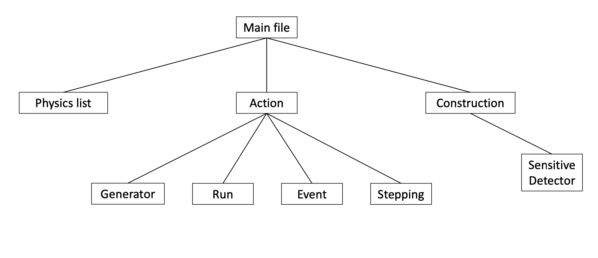

# Geant4


[Geant4](https://geant4.web.cern.ch/) is a powerful, open-source simulation toolkit used to model the interaction of particles with matter. It's widely used in various fields, including:

<div class="grid cards" markdown>

- **High-Energy Physics**: Simulating particle collisions, detector responses, and data analysis.
- **Nuclear Physics**: Studying nuclear reactions, radiation transport, and detector simulations.
- **Medical Physics**: Modeling radiation therapy, dosimetry, and medical imaging.
- **Space Exploration**: Simulating radiation effects on spacecraft, astronauts, and electronic components.
- **Materials Science**: Investigating radiation damage, radiation-induced effects, and materials properties.

</div>

[Geant4](https://geant4.web.cern.ch/) provides a comprehensive framework for simulating the transport of particles, such as electrons, photons, neutrons, and ions, through various materials and detectors. It takes into account complex physical processes, including:

- Ionization and excitation
- Bremsstrahlung and pair production
- Compton scattering and photoelectric effects
- Hadronic interactions and nuclear reactions

The toolkit allows the user to define:

- Interaction physics
- Geometry and composition of the matter (detector)
- Particle generation
- Data readout
- Vizualisation

[Geant4](https://geant4.web.cern.ch/) is written in C++ and provides a flexible, modular architecture, allowing users to customize and extend the toolkit to suit their specific needs. There is also a possibility to use [Geant4](https://geant4.web.cern.ch/) with Python.

!!! info
    Basic understanding of the framework can be obtained by following this [youtube playlist](https://www.youtube.com/playlist?list=PLLybgCU6QCGWgzNYOV0SKen9vqg4KXeVL). 

## Installation & setup

The instruction for a local installation one needs to follow the [dedicated official documentation](https://geant4.web.cern.ch/docs/). 

On sunrise machine, Geant4 can be set up by ... #todo

## Simulation setup

There are three components that need to be prepared for each simulation:

<div class="grid cards" markdown>

-   **Construction definition**

    ---

    Definition of the geometry and material of the detector or general volume, that we want to simulate. 

    [:octicons-arrow-right-24: More](#construction-definition)

-   **Physics list**

    ---

    Definition of the actual physics that will be active during the simulation. 
    
    This is mainly for speed purposes: for example during simulation of electrons in electromagnetic calorimeters, no hadronic processes are needed so we can turn them off and speed up the simulation.

    [:octicons-arrow-right-24: More](#physics-list-definition)

-   **Action definition**

    ---

    Definition of various action performed during the simulations: generation of particles, detection of particles, tracking and stepping.

    [:octicons-arrow-right-24: More](#action-definition)

</div>



=== "C++"

    In `C++`, each part needs to be writted as a separate class, for clarity purposes with its own header and definition file. The typical file structure is therefore

    ```
    mainFile.cc
    CMakeLists.txt
    include/
        construction.hh
        physicsList.hh
        action.hh
    src/
        construction.cc
        physicsList.cc
        action.cc
    ```

    The structure of the main file is explained [later](#main-file). 

    The `CMakeLists.txt` is required for proper compilation of the multiple files. For details, refer to [Running the simulation](#running-the-simulation).

=== "Python"

    In `Python`, each part needs to be writtes as a separate class. However, thanks to simplicity of `Python`, it is recommanded to keep everything in one file, unless the project is very complicated. 


### Main file

In the main file, we tell Geant what files we want to use to define the individual parts of the simulation, start the GUI and apply basic commands. 

=== "C++"

    ```c title="mainFile.cc"
    #include "iostream"

    // We import the Geant stuff
    #include "G4RunManager.hh"
    #include "G4UIExecutive.hh"
    #include "G4VisExecutive.hh"
    #include "G4VisManager.hh"
    #include "G4UImanager.hh"

    // We import our header files for construction, physics list and action
    #include "include/construction.hh"
    #include "include/physicsList.hh"
    #include "include/action.hh"

    int main(int argc, char** argv){
        // We initialise the Geant4 manager
        auto *runManager = new G4RunManager();
        
        // We tell Geant what construction, physics list and action to use
        // these classes are defined in the imported header files
        runManager->SetUserInitialization(new ConstructionDefinition());
        runManager->SetUserInitialization(new PhysicsListDefinition());
        runManager->SetUserInitialization(new ActionDefinition());

        // We initialise the Geant4 manager
        runManager->Initialize();

        // We prepare and initialise the GUI
        auto *ui = new G4UIExecutive(argc, argv);
        auto *visManager = new G4VisExecutive();
        visManager->Initialize();

        // We can send commands (e.g. create particles) from 
        // the GUI or from here already using the UImanager
        G4UImanager *UImanager =  G4UImanager::GetUIpointer();
        // Commands are applied like this: 
        // this one tells the UI to run 10 particles
        UImanager->ApplyCommand("/run/beamOn 10");

        // Finally we start the session
        ui->SessionStart();

        return 0;
    }

    ```

=== "Python"

    ```python title="mainFile.py"
    # We import Geant4
    from geant4_pybind import *

    # We either import the required classes (construction, physics list, action) 
    # from separate definition files or define them here above the main funciton

    def main(electronEnergy, foilWidth, fPath, nParticles):
        # We initialise the Geant4 manager
        runManager = G4RunManagerFactory.CreateRunManager(G4RunManagerType.Serial)

        # We tell Geant what construction, physics list and action to use
        # These classes need to be defined by us
        runManager.SetUserInitialization(ConstructionDefinition())
        runManager.SetUserInitialization(PhysicsListDefinition())
        runManager.SetUserInitialization(ActionDefinition())

        # We initialise the Geant4 manage
        runManager.Initialize()

        # We prepare and initialise the GUI
        ui = G4UIExecutive()
        visManager = G4VisExecutive()
        visManager.Initialize()

        # We can send commands (e.g. create particles) from 
        # the GUI or from here already using the UImanager
        UImanager = G4UImanager.GetUIpointer()

        # Commands are applied like this: 
        # this one tells the UI to run 10 particles
        UImanager.ApplyCommand(f"/run/beamOn {int(nParticles)}")
        
        # Finally we start the session
        ui.SessionStart()

    # This will automatically call the main function 
    # when we write `python mainFile.py` to the terminal
    if __name__ == "__main__":
        main()
    ```

### Construction definition

Detector / volume construction is performed in three steps:

- **Solid volume** - definition of shape and proportions
- **Logical volume** - definition of the material
- **Physical volume** - setting the volume in space

The implementation is performed via the [`G4VUserDetectorConstruction` class](https://apc.u-paris.fr/~franco/g4doxy/html/classG4VUserDetectorConstruction.html).

For demonstration, we create a golden plate in a vacuum. First we create the "vacuum box":

=== "C++"

    ```c title="include/construction.hh"

    #ifndef DETECTORCONSTRUCTION_HH
    #define DETECTORCONSTRUCTION_HH

    #include "G4VUserDetectorConstruction.hh"
    #include "G4VPhysicalVolume.hh"


    class DetectorConstruction : public G4VUserDetectorConstruction { // (1)!
    public:
        DetectorConstruction();
        ~DetectorConstruction();

        G4VPhysicalVolume *Construct(); // (2)!
    };


    #endif //DETECTORCONSTRUCTION_HH

    ```

    1. We derive our class from the [`G4VUserDetectorConstruction` class](https://apc.u-paris.fr/~franco/g4doxy/html/classG4VUserDetectorConstruction.html).
    2. This is the actual method that we will use in the `src/construction.cc` to construct the volume (see bellow).

    ```c title="src/construction.cc"
    // Geant4 includes
    #include <G4Box.hh>
    #include <G4SystemOfUnits.hh>
    #include <G4NistManager.hh>
    #include <G4LogicalVolume.hh>
    #include <G4PVPlacement.hh>
    #include <G4VPhysicalVolume.hh>
    #include <G4Material.hh>

    // We include the header file
    #include "../include/construction.hh" // (1)!

    // Simple constructor and destructor
    DetectorConstruction::DetectorConstruction(){};
    DetectorConstruction::~DetectorConstruction(){};

    // Construction method itself
    G4VPhysicalVolume *DetectorConstruction::Construct() {
        // We define the foil size and the world size
        double foil_sizeXY = 1. * cm; // (7)!
        double foil_sizeZ = 1000. * um;

        double world_sizeXY = foil_sizeXY * 1.2;
        double world_sizeZ = foil_sizeZ * 2 + 1*cm;

        // We create an instance of the material manager
        G4NistManager *nist = G4NistManager::Instance(); // (2)!

        // VACUUM BOX CONSTRUCTION
        auto worldMaterial = nist->FindOrBuildMaterial("G4_Galactic"); // (3)!
        auto *solidWorld = new G4Box("World", 0.5 * world_sizeXY, 0.5 * world_sizeXY, 0.5 *world_sizeZ); // (4)!
        auto *logicWorld = new G4LogicalVolume(solidWorld, worldMaterial, "World"); // (5)!

        G4VPhysicalVolume *physWorldVolume = new G4PVPlacement(nullptr,  // (6)!
                                                            G4ThreeVector(0., 0., 0.),
                                                            logicWorld,
                                                            "World",
                                                            nullptr,
                                                            false,
                                                            0,
                                                            true
        );
    }
    ```

    1. This header file must include the definition of the classes that are implemented in this file.   
    2. There is a [list of predefined materials](https://geant4-userdoc.web.cern.ch/UsersGuides/ForApplicationDeveloper/html/Appendix/materialNames.html) that we can use. Alternatively, we can [define the material ourselves](#definition-of-custom-material).
    3. There is not exactly vacuum in Geant4, so we select the material with the lowest density instead. The list of possible materials is [here](https://geant4-userdoc.web.cern.ch/UsersGuides/ForApplicationDeveloper/html/Appendix/materialNames.html).
    4. This is the *solid volume* definition step: it defines the dimensions of the material. **The parameters are: name, X length, Y length, Z length.** [List of other shapes](https://apc.u-paris.fr/~franco/g4doxy/html/classG4CSGSolid.html).
    5. Here we take the *solid volume* defined on the previous line and assign the material to it. The last argument is the (arbitrary) name.
    6. Finally, we place the volume as the *physical volume*. The arguments are following: 
        1. rotation of the volume (we do not want to rotate that)
        2. position in space (no need to overthink, we put it in the center),
        3. the *logic volume* that we want to use (the one we defined on previous line),
        4. the name of the volume,
        5. parent volume (this is the top volume, so there is no parent volume),
        6. bool options if we want to add multiple instances of this volume (we don't want that here),
        7. number of copies (again, we do not want that here),
        8. bool option for volume check: checks overlaps of volumes, which may cause problems in the simulations (**we almost always want this on**).
     7. Thanks to `#include <G4SystemOfUnits.hh>` we can use the standard units (it just effectively multiplies it by the appropriate factor to match the base units Geant4 works with).

=== "Python"

    ```python title="mainFile.py or construction.py"
    from geant4_pybind import *

    class Construction(G4VUserDetectorConstruction):
        def Construct(self):
            # We define the foil size and the world size
            foil_sizeXY = 1 * cm # (6)!
            foil_sizeZ = 1000 * um

            world_sizeXY = foil_sizeXY * 1.2
            world_sizeZ = foil_sizeZ * 2 + 1 * cm

            # We create an instance of the material manager
            nist = G4NistManager.Instance() # (1)!
 
            # Can't select vacuum as it hase density 0 -> G4_Galactic has very low density
            world_material = nist.FindOrBuildMaterial("G4_Galactic") # (2)!

            # VACUUM BOX CONSTRUCTION
            solidWorld = G4Box("World", 0.5 * world_sizeXY, 0.5 * world_sizeXY, 0.5 * world_sizeZ) # (3)!
            logicWorld = G4LogicalVolume(solidWorld, world_material, name="World") # (4)!

            physWorld = G4PVPlacement(None,  # (5)!
                                    G4ThreeVector(),  
                                    logicWorld,  
                                    "World", 
                                    None,  
                                    False,  
                                    0,  
                                    True)  
    ```
 
    1. There is a [list of predefined materials](https://geant4-userdoc.web.cern.ch/UsersGuides/ForApplicationDeveloper/html/Appendix/materialNames.html) that we can use. Alternatively, we can [define the material ourselves](#definition-of-custom-material).
    2. There is not exactly vacuum in Geant4, so we select the material with the lowest density instead. The list of possible materials is [here](https://geant4-userdoc.web.cern.ch/UsersGuides/ForApplicationDeveloper/html/Appendix/materialNames.html).
    3. This is the *solid volume* definition step: it defines the dimensions of the material. **The parameters are: name, X length, Y length, Z length.**
    4. Here we take the *solid volume* defined on the previous line and assign the material to it.
    5. Finally, we place the volume as the *physical volume*. The arguments are following: 
        1. rotation of the volume (we do not want to rotate that)
        2. position in space (no need to overthink, we put it in the center),
        3. the *logic volume* that we want to use (the one we defined on previous line),
        4. the name of the volume,
        5. parent volume (this is the top volume, so there is no parent volume),
        6. bool options if we want to add multiple instances of this volume (we don't want that here),
        7. number of copies (again, we do not want that here),
        8. bool option for volume check: checks overlaps of volumes, which may cause problems in the simulations (**we almost always want this on**).
     6. Thanks to `from geant4_pybind import *` we also imported the units namelist from Geant4 and therefore we can use the standard units like this (it just effectively multiplies it by the appropriate factor to match the base units Geant4 works with).

Similarly, we can implement the golden foil itself: we need to use different dimension, different material, and we want to place the foil inside the vacuum box :octicons-arrow-right-24: we select the vacuum box as the parent volume. We continue in the `Construct` method:

=== "C++"

    ```c title="src/construction.cc"
    ...
    // The construction method that we worked with
    G4VPhysicalVolume *DetectorConstruction::Construct() {
        // Implementation of the vacuum box from above
        ...

        // After that, we want to add the golden foil
        auto *foilMaterial = nist->FindOrBuildMaterial("G4_Au");
        auto *solidFoil = new G4Box("Foil", 0.5 * foil_sizeXY, 0.5 * foil_sizeXY, 0.5 * foil_sizeZ);
        auto *logicFoil = new G4LogicalVolume(solidFoil, foilMaterial, "Foil");

        G4VPhysicalVolume *physFoilVolume = new G4PVPlacement(nullptr,                  // no rotation
                                                            G4ThreeVector(0., 0., 0.),  // position in the center
                                                            logicFoil,                  // corresponding logical volume
                                                            "Foil",                     // name
                                                            logicWorld,                 // parent volume
                                                            false,                      // no multiples
                                                            0,                          // no copies
                                                            true);                      // check for overlaps
                                                            //(1)! 
    }
    ```

    1. Note that we use the `logicWorld` (vacuum box defined above) as the parent volume.

=== "Python"

    ```python title="mainFile.py or construction.py"
    from geant4_pybind import *

    class Construction(G4VUserDetectorConstruction):
        def Construct(self):
            # Implementation of the vacuum box from above
            ...

            # After that, we want to add the golden foil
            foil_material = nist.FindOrBuildMaterial("G4_Au")
            solidFoil = G4Box("Foil", 0.5 * foil_sizeXY, 0.5 * foil_sizeXY, 0.5 * foil_sizeZ)
            logicFoil = G4LogicalVolume(solidFoil, foil_material, name="Foil")
            physFoil = G4PVPlacement(None,              # no rotation
                                    G4ThreeVector(),    # position in the center
                                    logicFoil,          # corresponding logical volume
                                    "Foil",             # name
                                    logicWorld,         # parent volume 
                                    True,               # no multiples
                                    0,                  # no copies
                                    True)               # check for overlaps
                                    # (1)! 
    ```

    1. Note that we use the `logicWorld` (vacuum box defined above) as the parent volume.

??? example "Full example"

    === "C++"
        ```c title="include/construction.hh"

        #ifndef DETECTORCONSTRUCTION_HH
        #define DETECTORCONSTRUCTION_HH

        #include "G4VUserDetectorConstruction.hh"
        #include "G4VPhysicalVolume.hh"


        class DetectorConstruction : public G4VUserDetectorConstruction { // (1)!
        public:
            DetectorConstruction();
            ~DetectorConstruction();

            G4VPhysicalVolume *Construct(); // (2)!
        };


        #endif //DETECTORCONSTRUCTION_HH

        ```

        1. We derive our class from the [`G4VUserDetectorConstruction` class](https://apc.u-paris.fr/~franco/g4doxy/html/classG4VUserDetectorConstruction.html).
        2. This is the actual method that we will use in the `src/construction.cc` to construct the volume (see bellow).


        ```c title="src/construction.cc"
        // Geant4 includes
        #include <G4Box.hh>
        #include <G4SystemOfUnits.hh>
        #include <G4NistManager.hh>
        #include <G4LogicalVolume.hh>
        #include <G4PVPlacement.hh>
        #include <G4VPhysicalVolume.hh>
        #include <G4Material.hh>

        // We include the header file
        #include "../include/construction.hh" // (1)!

        // Simple constructor and destructor
        DetectorConstruction::DetectorConstruction(){};
        DetectorConstruction::~DetectorConstruction(){};

        // Construction method itself
        G4VPhysicalVolume *DetectorConstruction::Construct() {
            // We define the foil size and the world size
            double foil_sizeXY = 1. * cm; // (7)!
            double foil_sizeZ = 1000. * um;

            double world_sizeXY = foil_sizeXY * 1.2;
            double world_sizeZ = foil_sizeZ * 2 + 1*cm;

            // We create an instance of the material manager
            G4NistManager *nist = G4NistManager::Instance(); // (2)!

            // VACUUM BOX CONSTRUCTION
            auto worldMaterial = nist->FindOrBuildMaterial("G4_Galactic"); // (3)!
            auto *solidWorld = new G4Box("World", 0.5 * world_sizeXY, 0.5 * world_sizeXY, 0.5 *world_sizeZ); // (4)!
            auto *logicWorld = new G4LogicalVolume(solidWorld, worldMaterial, "World"); // (5)!

            G4VPhysicalVolume *physWorldVolume = new G4PVPlacement(nullptr,  // (6)!
                                                                G4ThreeVector(0., 0., 0.),
                                                                logicWorld,
                                                                "World",
                                                                nullptr,
                                                                false,
                                                                0,
                                                                true
            );

            // After that, we want to add the golden foil
            auto *foilMaterial = nist->FindOrBuildMaterial("G4_Au");
            auto *solidFoil = new G4Box("Foil", 0.5 * foil_sizeXY, 0.5 * foil_sizeXY, 0.5 * foil_sizeZ);
            auto *logicFoil = new G4LogicalVolume(solidFoil, foilMaterial, "Foil");

            G4VPhysicalVolume *physFoilVolume = new G4PVPlacement(nullptr,                  // no rotation
                                                                G4ThreeVector(0., 0., 0.),  // position in the center
                                                                logicFoil,                  // corresponding logical volume
                                                                "Foil",                     // name
                                                                logicWorld,                 // parent volume
                                                                false,                      // no multiples
                                                                0,                          // no copies
                                                                true);                      // check for overlaps
                                                                //(8)! 
        }

        ```

        1. This header file must include the definition of the classes that are implemented in this file.   
        2. There is a [list of predefined materials](https://geant4-userdoc.web.cern.ch/UsersGuides/ForApplicationDeveloper/html/Appendix/materialNames.html) that we can use. Alternatively, we can [define the material ourselves](#definition-of-custom-material).
        3. There is not exactly vacuum in Geant4, so we select the material with the lowest density instead. The list of possible materials is [here](https://geant4-userdoc.web.cern.ch/UsersGuides/ForApplicationDeveloper/html/Appendix/materialNames.html).
        4. This is the *solid volume* definition step: it defines the dimensions of the material. **The parameters are: name, X length, Y length, Z length.**
        5. Here we take the *solid volume* defined on the previous line and assign the material to it. The last argument is the (arbitrary) name.
        6. Finally, we place the volume as the *physical volume*. The arguments are following: 
           1. rotation of the volume (we do not want to rotate that)
           2. position in space (no need to overthink, we put it in the center),
           3. the *logic volume* that we want to use (the one we defined on previous line),
           4. the name of the volume,
           5. parent volume (this is the top volume, so there is no parent volume),
           6. bool options if we want to add multiple instances of this volume (we don't want that here),
           7. number of copies (again, we do not want that here),
           8. bool option for volume check: checks overlaps of volumes, which may cause problems in the simulations (**we almost always want this on**).
        7. Thanks to `#include <G4SystemOfUnits.hh>` we can use the standard units (it just effectively multiplies it by the appropriate factor to match the base units Geant4 works with).
        8. Note that we use the `logicWorld` (vacuum box defined above) as the parent volume.

    === "Python"
        ```python title="mainFile.py or construction.py"
        from geant4_pybind import *

        class Construction(G4VUserDetectorConstruction):
            def Construct(self):
                # We define the foil size and the world size
                foil_sizeXY = 1 * cm # (6)!
                foil_sizeZ = 1000 * um

                world_sizeXY = foil_sizeXY * 1.2
                world_sizeZ = foil_sizeZ * 2 + 1 * cm

                # We create an instance of the material manager
                nist = G4NistManager.Instance() # (1)!
    
                # Can't select vacuum as it hase density 0 -> G4_Galactic has very low density
                world_material = nist.FindOrBuildMaterial("G4_Galactic") # (2)!

                # VACUUM BOX CONSTRUCTION
                solidWorld = G4Box("World", 0.5 * world_sizeXY, 0.5 * world_sizeXY, 0.5 * world_sizeZ) # (3)!
                logicWorld = G4LogicalVolume(solidWorld, world_material, name="World") # (4)!

                physWorld = G4PVPlacement(None,  # (5)!
                                        G4ThreeVector(),  
                                        logicWorld,  
                                        "World", 
                                        None,  
                                        False,  
                                        0,  
                                        True)  

                # After that, we want to add the golden foil
                foil_material = nist.FindOrBuildMaterial("G4_Au")
                solidFoil = G4Box("Foil", 0.5 * foil_sizeXY, 0.5 * foil_sizeXY, 0.5 * foil_sizeZ)
                logicFoil = G4LogicalVolume(solidFoil, foil_material, name="Foil")
                physFoil = G4PVPlacement(None,              # no rotation
                                        G4ThreeVector(),    # position in the center
                                        logicFoil,          # corresponding logical volume
                                        "Foil",             # name
                                        logicWorld,         # parent volume 
                                        True,               # no multiples
                                        0,                  # no copies
                                        True)               # check for overlaps
                                        # (7)! 
        ```

        1. There is a [list of predefined materials](https://geant4-userdoc.web.cern.ch/UsersGuides/ForApplicationDeveloper/html/Appendix/materialNames.html) that we can use. Alternatively, we can [define the material ourselves](#definition-of-custom-material).
        2. There is not exactly vacuum in Geant4, so we select the material with the lowest density instead. The list of possible materials is [here](https://geant4-userdoc.web.cern.ch/UsersGuides/ForApplicationDeveloper/html/Appendix/materialNames.html).
        3. This is the *solid volume* definition step: it defines the dimensions of the material. **The parameters are: name, X length, Y length, Z length.** [List of other shapes](https://apc.u-paris.fr/~franco/g4doxy/html/classG4CSGSolid.html).
        4. Here we take the *solid volume* defined on the previous line and assign the material to it.
        5. Finally, we place the volume as the *physical volume*. The arguments are following: 
            1. rotation of the volume (we do not want to rotate that)
            2. position in space (no need to overthink, we put it in the center),
            3. the *logic volume* that we want to use (the one we defined on previous line),
            4. the name of the volume,
            5. parent volume (this is the top volume, so there is no parent volume),
            6. bool options if we want to add multiple instances of this volume (we don't want that here),
            7. number of copies (again, we do not want that here),
            8. bool option for volume check: checks overlaps of volumes, which may cause problems in the simulations (**we almost always want this on**).
        6. Thanks to `from geant4_pybind import *` we also imported the units namelist from Geant4 and therefore we can use the standard units like this (it just effectively multiplies it by the appropriate factor to match the base units Geant4 works with).
        7. Note that we use the `logicWorld` (vacuum box defined above) as the parent volume.


!!! info
    Apart from the box that we have used, there are also other shapes (sphere, cone, ...), see the [list of shapes](https://apc.u-paris.fr/~franco/g4doxy/html/classG4CSGSolid.html).

#### Definition of custom material

All elements are predefined in Geant4, the list of them can be found [here](https://geant4-userdoc.web.cern.ch/UsersGuides/ForApplicationDeveloper/html/Appendix/materialNames.html). However, sometimes we need to create a compound from different elements. 

For this we define our own material via the [`G4Material` class](https://apc.u-paris.fr/~franco/g4doxy/html/classG4Material.html). We define the density of the material and number of components, which we will add.

=== "C++"

    ```c 
    #include "G4Material.hh"
    #include "G4Element.hh"
    #include "G4NistManager.hh"

    // Get the predefined elements that our material comprises of
    G4Element* C = G4NistManager::Instance()->FindOrBuildElement("C");
    G4Element* O = G4NistManager::Instance()->FindOrBuildElement("O");
    G4Element* N = G4NistManager::Instance()->FindOrBuildElement("N");

    // Define the material
    G4Material* MyMaterial = new G4Material("MyMaterial", 1.2*g/cm3, 3); // name of the material, density, number of elements
    MyMaterial->AddElement(C, 0.5); // 50% Carbon by weight
    MyMaterial->AddElement(O, 0.3); // 30% Oxygen by weight
    MyMaterial->AddElement(N, 0.2); // 20% Nitrogen by weight
    ```

=== "Python"

    ```python
    from geant4_pybind import *

    # Get the predefined elements that our material comprises of
    C = G4Element.GetElement("C")
    O = G4Element.GetElement("O")
    N = G4Element.GetElement("N")

    # Define the material
    MyMaterial = G4Material("MyMaterial", 1.2*g/cm3, 3) # name of the material, density, number of elements
    MyMaterial.AddElement(C, 0.5)  # 50% Carbon by weight
    MyMaterial.AddElement(O, 0.3)  # 30% Oxygen by weight
    MyMaterial.AddElement(N, 0.2)  # 20% Nitrogen by weight
    ```

!!! info
    The material definition would be performed inside the `Construct` method in the `G4VUserDetectorConstruction` that we work with. 

    In other words, replace the line with `FindOrBuildMaterial` in the codes [here](#construction-definition) by the lines above. 

??? example "Full example"

    === "C++"

        ```c title="include/construction.hh"

        #ifndef DETECTORCONSTRUCTION_HH
        #define DETECTORCONSTRUCTION_HH

        #include "G4VUserDetectorConstruction.hh"
        #include "G4VPhysicalVolume.hh"


        class DetectorConstruction : public G4VUserDetectorConstruction {
        public:
            DetectorConstruction();
            ~DetectorConstruction();

            G4VPhysicalVolume *Construct(); 
        };


        #endif //DETECTORCONSTRUCTION_HH

        ```

        ```c title="src/construction.cc" hl_lines="9 30-43 46"
        // Geant4 includes
        #include <G4Box.hh>
        #include <G4SystemOfUnits.hh>
        #include <G4NistManager.hh>
        #include <G4LogicalVolume.hh>
        #include <G4PVPlacement.hh>
        #include <G4VPhysicalVolume.hh>
        #include <G4Material.hh>
        #include "G4Element.hh"

        // We include the header file
        #include "../include/construction.hh" 

        // Simple constructor and destructor
        DetectorConstruction::DetectorConstruction(){};
        DetectorConstruction::~DetectorConstruction(){};

        // Construction method itself
        G4VPhysicalVolume *DetectorConstruction::Construct() {
            // We define the foil size and the world size
            double foil_sizeXY = 1. * cm; 
            double foil_sizeZ = 1000. * um;

            double world_sizeXY = foil_sizeXY * 1.2;
            double world_sizeZ = foil_sizeZ * 2 + 1*cm;

            // We create an instance of the material manager
            G4NistManager *nist = G4NistManager::Instance(); 

            // BOX CONSTRUCTION
            // (1)!
            // auto worldMaterial = nist->FindOrBuildMaterial("G4_Galactic"); 

            // Get the predefined elements that our material comprises of
            G4Element* C = G4NistManager::Instance()->FindOrBuildElement("C");
            G4Element* O = G4NistManager::Instance()->FindOrBuildElement("O");
            G4Element* N = G4NistManager::Instance()->FindOrBuildElement("N");

            // Define the material
            G4Material* MyMaterial = new G4Material("MyMaterial", 1.2*g/cm3, 3); // name of the material, density, number of elements
            MyMaterial->AddElement(C, 0.5); // 50% Carbon by weight
            MyMaterial->AddElement(O, 0.3); // 30% Oxygen by weight
            MyMaterial->AddElement(N, 0.2); // 20% Nitrogen by weight

            auto *solidWorld = new G4Box("World", 0.5 * world_sizeXY, 0.5 * world_sizeXY, 0.5 *world_sizeZ); // (4)!
            auto *logicWorld = new G4LogicalVolume(solidWorld, MyMaterial, "World"); 

            G4VPhysicalVolume *physWorldVolume = new G4PVPlacement(nullptr,  
                                                                G4ThreeVector(0., 0., 0.),
                                                                logicWorld,
                                                                "World",
                                                                nullptr,
                                                                false,
                                                                0,
                                                                true
            );
        }
        ```

        1. This is what we used before in the [main file](#main-file). We replace it by our own material.

    === "Python"

        ```python title="mainFile.py or construction.py" hl_lines="15-29 32"
        from geant4_pybind import *

        class Construction(G4VUserDetectorConstruction):
            def Construct(self):
                # We define the foil size and the world size
                foil_sizeXY = 1 * cm 
                foil_sizeZ = 1000 * um

                world_sizeXY = foil_sizeXY * 1.2
                world_sizeZ = foil_sizeZ * 2 + 1 * cm

                # We create an instance of the material manager
                nist = G4NistManager.Instance() 
    
                # Can't select vacuum as it hase density 0 -> G4_Galactic has very low density
                # (1)!
                # world_material = nist.FindOrBuildMaterial("G4_Galactic") 

                # Get the predefined elements that our material comprises of
                C = G4Element.GetElement("C")
                O = G4Element.GetElement("O")
                N = G4Element.GetElement("N")

                # Define the material
                MyMaterial = G4Material("MyMaterial", 1.2*g/cm3, 3) # name of the material, density, number of elements
                MyMaterial.AddElement(C, 0.5)  # 50% Carbon by weight
                MyMaterial.AddElement(O, 0.3)  # 30% Oxygen by weight
                MyMaterial.AddElement(N, 0.2)  # 20% Nitrogen by weight

                # BOX CONSTRUCTION
                solidWorld = G4Box("World", 0.5 * world_sizeXY, 0.5 * world_sizeXY, 0.5 * world_sizeZ) 
                logicWorld = G4LogicalVolume(solidWorld, MyMaterial, name="World") 

                physWorld = G4PVPlacement(None,  
                                        G4ThreeVector(),  
                                        logicWorld,  
                                        "World", 
                                        None,  
                                        False,  
                                        0,  
                                        True)  
        ```
        
        2. This is what we used before in the [main file](#main-file). We replace it by our own material.

For advanced, the `G4Element` can be defined by us: this can be useful when we want to use specific isotopic composition. See the example bellow, where we want to create LiH with two different isotopes of lithium.

=== "C++"

    ```c
    G4Material *LiH = new G4Material("LiH", 0.78*g/cm3, 2); // name, density
    G4Isotope *Li7 = new G4Isotope("Li7", 3, 7); // name, atomic number Z, nucleon number N
    G4Isotope *Li6 = new G4Isotope("Li6", 3, 6); // name, atomic number Z, nucleon number N
    G4Element *Li = new G4Element("Li", "Li", 2); // name, symbol, number of isotopes

    // We add the isotopes to Li
    Li->AddIsotope(Li7, 5*perCent); // what isotope we add, its percentage
    Li->AddIsotope(Li6, 95*perCent); // what isotope we add, its percentage

    // Finaly we make the LiH: which means adding 1 atom of Li and 1 atom of H
    LiH->AddElement(Li, 1); // element we are adding, number of atoms
    LiH->AddElement(nist->FindOrBuildElement("H"), 1); // element we are adding, number of atoms
    ```

=== "Python"

    ```python
    LiH = G4Material("LiH", 0.78*g/cm3, 2) # name, density
    Li7 = G4Isotope("Li7", 3, 7)  # name, atomic number Z, nucleon number N
    Li6 = G4Isotope("Li6", 3, 6)  # name, atomic number Z, nucleon number N
    Li = G4Element("Li", "Li", 2) # name, symbol, number of isotopes

    # We add the isotopes to Li
    Li.AddIsotope(Li7, 5*perCent) # what isotope we add, its percentage
    Li.AddIsotope(Li6, 95*perCent) # what isotope we add, its percentage

    # Finaly we make the LiH: which means adding 1 atom of Li and 1 atom of H
    LiH.AddElement(Li, 1) # element we are adding, number of atoms
    LiH.AddElement(nist.FindOrBuildElement("H"), 1) # element we are adding, number of atoms
    ```

### Physics list definition

One could either define own physics list or use a [predefined one](https://geant4-internal.web.cern.ch/support/physics_lists). 

#### Using predefined physics list
To use a predefined physics list, we need to create an instance of that physics list in the [main file](#main-file) and set in using the `SetUserInitialization` method. In this case, we no longer need the `physicsList.hh` and `physicsList.cc` files. 

=== "C++"

    ```c title="mainFile.cc"
    #include "QBBC.hh"
    // other includes
    // (1)!
    int main(int argc, char** argv){
        ...
        G4VModularPhysicsList *physicsList = new QBBC; // QGSC + BinaryCascade + Bertini + CHIPS
        //physicsList->RegisterPhysics (new G4OpticalPhysics()); // Cv. part one
        runManager->SetUserInitialization(physicsList); // adds physics list
        ...
    }
    ```

    1. This is the main file presented in the [Main file section](#main-file).

=== "Python"

    ```python title="mainFile.py"
    
    from geant4_pybind import *
    # (1!
    def main():
        ...
        runManager.SetUserInitialization(QBBC()) # QGSC + BinaryCascade + Bertini + CHIPS
        ...
    ```

    1. This is the main file presented in the [Main file section](#main-file).

In other words, there is only change in the [main file](#main-file) depending on what predefined physics list we choose.

!!! info
    Find the list of predefined physics list [here](https://geant4-internal.web.cern.ch/support/physics_lists).

#### Using own physics list
To define own physics list, we will use the [`G4VModularPhysicsList` class](https://apc.u-paris.fr/~franco/g4doxy/html/classG4VModularPhysicsList.html).

=== "C++"

    ```c title="include/physicsList.hh"

    #ifndef PHYSICSLIST_HH
    #define PHYSICSLIST_HH

    #include <G4VModularPhysicsList.hh>

    class PhysicsList : public G4VModularPhysicsList{
    public:
        PositronProductionPhysicsList();
        ~PositronProductionPhysicsList();
    };

    #endif //PHYSICSLIST_HH
    ```

    ```c title="src/physicsList.cc"

    #include <G4EmStandardPhysics.hh>
    #include <G4DecayPhysics.hh>
    #include <G4EmLowEPPhysics.hh>

    #include "../include/physicsList.hh"

    PhysicsList::PositronProductionPhysicsList() {
        RegisterPhysics (new G4EmStandardPhysics());
        RegisterPhysics (new G4EmLowEPPhysics());
        RegisterPhysics(new G4DecayPhysics());
    }

    PhysicsList::~PositronProductionPhysicsList() {};
    ```

=== "Python"

    ```python title="mainFile.py or physicsList.py"
    from geant4_pybind import *

        class PositronProductionPhysicsList(G4VModularPhysicsList):

        def __init__(self):
            super().__init__()

            # Default physics
            self.RegisterPhysics(G4DecayPhysics())

            # EM physics
            self.RegisterPhysics(G4EmStandardPhysics())

            # Decay physics
            self.RegisterPhysics(G4DecayPhysics())
    ```

Note that the `mainFile.cc` of `mainFile.py` would be exactly same as [here](#main-file) in this case. 

### Action definition

The action class allows us to define, among others, particle definition and particle detection. 

### Running the simulation

=== "C++"

    The environment with Geant4 must be correctly intialized.

    Due to the multiple files we have, we will use [CMake](https://cmake.org/) for compilation. We will work with the following file structure

    ```
    mainFile.cc
    CMakeLists.txt
    include/
        construction.hh
        physicsList.hh
        action.hh
    src/
        construction.cc
        physicsList.cc
        action.cc
    ```

    The `CMakeLists.txt` contains:

    ```cmake title="CMakeLists.txt"
    cmake_minimum_required(VERSION 2.6 FATAL_ERROR)

    project(example)

    find_package(Geant4 REQUIRED ui_all vis_all)

    include(${Geant4_USE_FILE})

    file(GLOB sources ${PROJECT_SOURCE_DIR}/src/*.cc)
    file(GLOB headers ${PROJECT_SOURCE_DIR}/include/*.hh)

    add_executable(positronProduction positronProduction.cc ${sources} ${headers}
            include/action.hh
            src/sensitiveDetector.cc
            src/DetectorConstruction.cc
            include/runAction.hh
            include/runAction.hh)
    target_link_libraries(positronProduction ${Geant4_LIBRARIES})

    add_custom_target(positronProductionCC DEPENDS positronProduction)

    ```

=== "Python"

    Python environment with Geant4 must be correctly initialized first. After that, we write into terminal

    ```shell
    python mainFile.py
    ```
